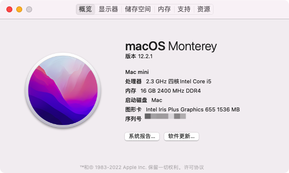
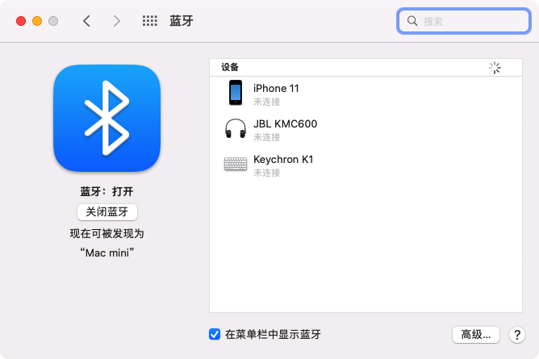

# NUC8I5BEH Hackintosh (OpenCore EFI)

 

### 说明

+ NUC8I5BEH原装，没有硬改，系统直装替换EFI后直接没问题：无线正常、蓝牙正常

### 配置
+ OS: macOS Monterey 12.2.1 x86_64 / Macmini8,1
+ OpenCore: 0.7.7
+ CPU: Intel® Core™ i5-8259U Processor (6M Cache, up to 3.80 GHz)
+ SSD: 500GB [SUMSUNG EVO980]
+ RAM: 8GB x 2 2666
+ BIOS: [0078]
+ Monitor: [AOC U28P2U 4K 28]

### BIOS设置
+ __Disable__
	- Legacy Boot
	- Fast Boot
	- Network Boot
	- Secure Boot
	- Inter VT for directed I/VO(VT-d)
+ __Enable__
	- Boot USB Devices First
	- Boot Network Devices Last
+ __Wake on LAN from S4/S5__
	- Stay Off

### 如何安装
1. Put **EFI** and **NUC8_MacOnlineInstaller** into a Fat 32 format USB flash driver's **root directory**
2. Run the corresponding script file in **NUC8_MacOnlineInstaller** depending on your operating system
3. Restart computer and install macOS with the USB flash driver After all steps above are completed

### 激活 iMessage/FaceTime
1. Genarate **Serial Number**, **Board Serial Number** and **SmUUID** with [Hackintool](https://github.com/headkaze/Hackintool)
2. Check your **Serial Number** on [https://checkcoverage.apple.com](https://checkcoverage.apple.com), and make sure the result looks like the picture below, otherwise genarate them again (and again)

3. Replace **Serial Number**, **Board Serial Number** and **SmUUID** in *config.plist*
4. Restart computer

---
